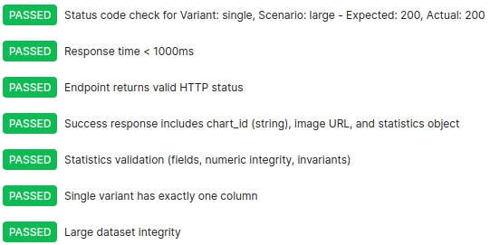
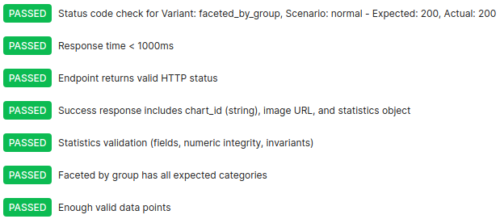
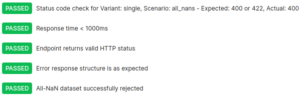
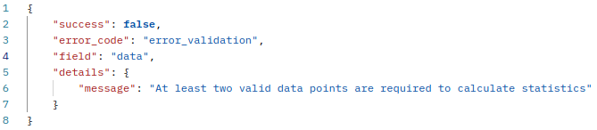
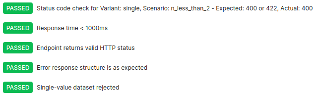

# Chart Refactoring - Boxplot Module 
> ### Changelog (v1.0.0) - 2025-12-26
#### All notable changes to this project are documented in this file. 

### ✨ **New Features**
- **Statistics Integration**: Added descriptive statistics table automatically displayed below charts
- **Unified Boxplot API**: Consolidated 6 separate boxplot endpoints into single `/boxplot` endpoint
- **Variant System**: Introduced clear variant configuration (`single`, `faceted_by_group`, `multipanel_columns`)
- **Enhanced Layout**: Improved figure layout using `gridspec` with dedicated space for statistics

### 🔄 **Changes**
- **Endpoint Consolidation**:
  - Removed `/boxplot1`, `/boxplot2`, `/boxplot3`, `/boxplot4`, `/boxplot5`, `/boxplot6`
  - Added single `/boxplot` endpoint with `variant` parameter
- **Data Structure**:
  - Added `dataset_name` field for statistics labeling
  - Added `variant` field to config
  - `categories` now optional (only required for `faceted_by_group` variant)
- **Class Structure**:
  - 6 separate classes → 1 unified `Boxplot` class with base inheritance (**DRY Principle Compliance**)
  - Added `BaseBoxplot` for shared functionality
  - Separated schemas into `boxplot_schemas.py`
- **Error Handling**:
  - Standardized validation using `BusinessLogicException` with field-specific messages
  - Improved error messages for invalid or missing data

### 📊 **Variant Mapping**
| Original Endpoint | New Variant | Description |
|-------------------|-------------|-------------|
| `/boxplot1` | `single` | Single boxplot (vertical/horizontal) |
| `/boxplot2` | `single` | Single boxplot with consistent styling |
| `/boxplot3` | `single` | Single boxplot with improved layout |
| `/boxplot4` | `single` | Single boxplot with grid |
| `/boxplot5` | `faceted_by_group` | Faceted by category groups |
| `/boxplot6` | `multipanel_columns` | Multi-column panel layout |

### 🛠 **Technical Improvements**
- **Factory Pattern**: Added `_create_figure()` method for consistent figure creation. Layouts and figure adjustments are now dynamically created via `_create_figure()`
- **Hook Methods**: `draw_boxplot()` and `compute_statistics()` as extensible hooks
- **Statistics Module**: New `statistics.py` with `calculate_descriptive_stats()` and `add_stats_table()`
- **Testing**: Comprehensive pytest suite with multiple scenarios (normal, large datasets, some NaNs, datasets with <2 valid points, all NaNs)

### 📈 **Statistics Included**
All boxplots now display:
- Sample size (n)
- Average and median
- Range (min-max)
- Standard deviation
- 95% Confidence Interval
- Quartiles (Q1, Q3) and IQR

### 🐛 **Bug Fixes**
- Consistent color scheme across all variants
- Proper NaN handling in statistics
- Fixed layout spacing issues that were present in the old layout

### ⚠️ **Deprecated**
- `Boxplot1` to `Boxplot6` classes replaced by unified `Boxplot` class
- Old endpoints are removed; use `/boxplot` with `variant` instead

### ✅ **Backward Compatibility**
- **Data format**: Mostly compatible (add `variant` and optional `dataset_name`)
- **Visual output**: Same styling with added statistics table
- **API response**: Same figure return format

### 📋 **Migration Guide**
1. Update endpoint from specific `/boxplotN` to `/boxplot`
2. Add `"variant": "single"` (or other variant) to config
3. Optionally add `"dataset_name": "Your Dataset"` to data
4. For faceted plots, ensure categories are provided

### 🧪 **Pytest Testing**
- Added comprehensive pytest suite
- Tests for:
  - Normal datasets
  - Large datasets (10,000 entries)
  - Datasets with some NaNs
  - Datasets with <2 valid points
  - Datasets with all NaNs
- Visual output verification
- Statistics calculation validation
  
**Run tests with coverage**:

```bash
PYTHONPATH=$(pwd) pytest \
    api/charts/evaluation/tests/test_boxplots.py \
    --cov=api.charts.evaluation.base_boxplot \
    --cov=api.charts.evaluation.boxplot \
    --cov=api.charts.evaluation.boxplot_schemas \
    --cov=api.charts.evaluation.statistics \
    --cov-report=term-missing \
    --cov-report=html
```
  **View HTML coverage report**:

```bash
xdg-open htmlcov/index.html
```

### 🧪 **Postman Testing**   *(Please refer to [Postman Tests README](tests/PostmanTests-README.md) for technical details)*

- Added scenario-aware dataset generation for: normal, some_nans, large, n_less_than_2, all_nans.
- Ensured variant-specific handling: single, faceted_by_group, multipanel_columns.
- Validated statistical fields, numeric integrity, and invariants (quartiles, IQR, range, CI bounds).
- Large dataset support: randomized 10,000-point generation with performance checks.
- Consistent error handling for invalid datasets (all_nans, n_less_than_2) and missing categories.


### 📁 **New File Structure**
```
api/charts/evaluation/
├── base_boxplot.py               # Base class with shared functionality
├── boxplot.py                    # Main Boxplot class with 3 variants (replaced files boxplot1-6.py)
├── boxplot_schemas.py            # Schemas
├── statistics.py                 # Statistics calculation and table rendering
└── evaluation_router.py          # FastAPI router (edited to match one endpoint)
```

### 🔧 **Dependencies Added**
- `scipy` for confidence interval calculation
- Enhanced `matplotlib.gridspec` usage

### 📸 **Screenshots**

| Scenario | Screenshot | What this proves |
|----------|------------|----------------|
| **Single Boxplot — Large** |  <br>  | Single variant renders high-volume data reliably; API response consistent. |
| **Faceted by Group — Normal** |  <br>  | Correct faceted rendering and full statistics per category. |
| **Multipanel Columns — Large** |  <br>  | Multi-column layout handles large datasets; API processes efficiently. |
| **Empty Dataset (All NaNs)** |  <br>  | Rendering blocked and API rejects all-NaN datasets with clear error. |
| **Single Value (n < 2)** |  <br>  | Boxplot not rendered for insufficient data; API enforces minimum sample size. |

### ⚠️ **Breaking Changes**
- Removal of individual boxplot endpoints
- Required `variant` parameter in config
- Statistics table always added (cannot be disabled in current implementation)
  
===============================================================================================================================================